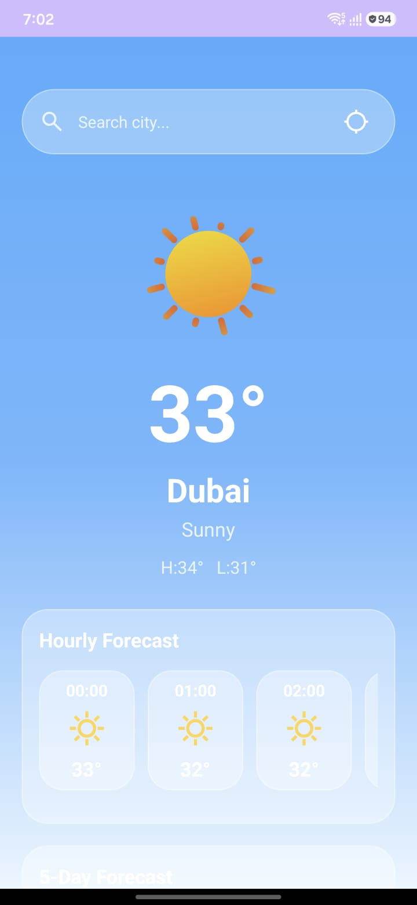
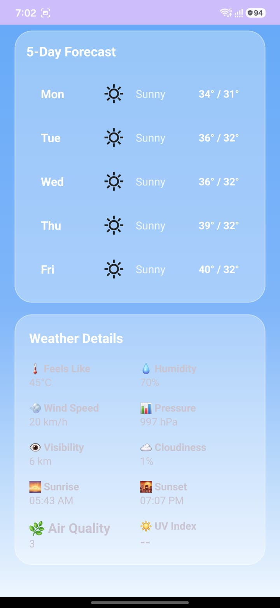

# 🌤️ Weather Forecast App

A modern Android weather application built with **Kotlin** that provides real-time weather information, hourly and 5-day forecasts, air quality data, and GPS-based weather detection using **WeatherAPI**.

---

## 📱 Features

- 🌍 Search weather by city
- 📍 Current location weather using GPS
- 🌤 Real-time weather conditions
- 🕒 Hourly weather forecast
- 📅 5-day weather forecast
- 🌅 Sunrise & Sunset information
- 🌫 Air Quality Index (AQI)
- 🎨 Dynamic weather backgrounds
- ✨ Lottie weather animations
- 🔄 Pull-to-refresh support
- 💾 Saves last searched city using SharedPreferences

---

## 🛠️ Built With

- Kotlin
- Android SDK
- XML Layouts
- Retrofit
- Coroutines
- WeatherAPI
- RecyclerView
- ViewBinding
- Material Design
- Google Location Services
- SharedPreferences
- Lottie Animations

---

## 📷 Screenshots

<p align="center">
  
  
</p>
---

---

## 🚀 Getting Started

### Clone the repository

```bash
git clone https://github.com/AliAbbas160/WeatherApp.git
```

### Open the project

Open the project using **Android Studio**.

### API Key

Create a free API key from:

https://www.weatherapi.com/

Add your API key in:

```kotlin
Constants.WEATHER_API_KEY
```

---

## 📌 Requirements

- Android Studio
- Android SDK 24+
- Internet Connection
- WeatherAPI Key

---

## 🎯 Future Improvements

- 🌙 Dark Mode
- 🌡️ Temperature unit switch (°C / °F)
- 💾 Offline weather cache
- 🔔 Weather alerts
- 📊 Weather charts

---

## 👨‍💻 Author

**Ali Abbas Gazge**

GitHub:
https://github.com/AliAbbas160
